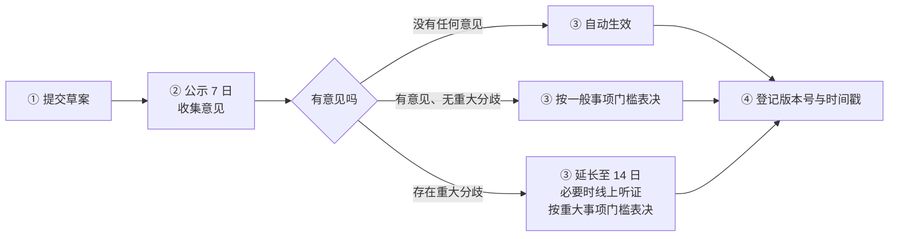

# 清屿服务器七日阳光流程

> **版本：** v1.0.0 ｜ **更新日期：** 2026.09.24 ｜ **生效日期：** 2026.10.01 ｜ **面向对象：** 全体玩家与运营团队

**先看这一句：** 规则不能"偷偷"改 —— 任何修订草案都必须先公示满 7 天，收集完意见才能生效。

这份文件是"七日阳光流程"的**完整定义**。其他规则文档里写"遵循七日阳光流程"，指的就是这份文件。赶时间的话，看每一条后面斜体那段就够了。

## 目录

- [第一章 为什么叫"七日阳光"](#第一章为什么叫七日阳光)
- [第二章 四步流程](#第二章四步流程)
- [第三章 谁在流程里做什么](#第三章谁在流程里做什么)
- [第四章 紧急修订](#第四章紧急修订)
- [第五章 适用范围](#第五章适用范围)
- [附 常见疑问](#附常见疑问)

---

## 第一章　为什么叫"七日阳光"

### 1.1 三条原则

规则是全体玩家共同遵守的行为契约。如果规则可以随意、悄悄修改，玩家就没法预判自己的行为是否合规。所以定了三条原则：

| 原则 | 含义 | 说人话 |
|------|------|--------|
| **知情权** | 每位玩家都有权在规则生效前知晓"要改什么、为什么改、什么时候生效" | 改之前让你知道 |
| **参与权** | 公示期内任何人都可以提出意见与建议 | 改的时候你能说话 |
| **透明度** | 草案、意见、表决、生效、登记全程留痕 | 改完你能查到 |

*说人话：这三条不是口号 —— 它们分别对应流程里的公示、意见收集、登记三个环节。流程不是走形式，是这三条原则的落地方式。*

### 1.2 "阳光"指什么

"阳光"取"阳光下没有阴影"之意：整个修订过程**全程公开、可查询、可追溯**，不存在暗箱操作的空间。

**"七日"是硬门槛**：公示不满 7 天，草案不能生效。这是给玩家留出足够的知情与表达时间。

---

## 第二章　四步流程

### 2.1 第一步：提交草案

运营团队在酝酿任何规则变更时，必须先形成**书面修订草案**，草案中要逐条列出新增、删减或修改的内容，并写明**变更理由**。

草案形成后，须同时在**官方 QQ 群公告**与**游戏内公告栏**两个渠道同步发布，并开放意见收集通道。

*说人话：不能"我觉得该改了"就直接改。得先写下来、说清为什么。*

### 2.2 第二步：公示与收集意见

草案发布后进入**为期 7 日**的公示期。公示期内：

- 任何玩家都可以提出支持、反对或修改建议
- 运营团队同步梳理、汇总各方意见
- 有价值的意见会被认真对待；存在争议的条款，运营团队应直接与提出人沟通

**公示期不是"走过场"。** 汇总后的意见应在表决前整理公示，作为投票依据。

*说人话：这是"七日"的核心 —— 不是等 7 天就完事，是这 7 天里真的在收集意见。*

### 2.3 第三步：表决与生效

公示期满后，按意见情况分三种结果：

| 情况 | 怎么走 | 门槛 |
|------|--------|------|
| **无任何意见** | 草案自动转为正式版并即时生效 | 无需表决 |
| **有意见，但无重大分歧** | 按一般事项门槛表决 | 参与 ≥ 3 人，赞成超过半数 |
| **存在重大分歧** | 公示期延长至 **14 日**，必要时召开线上听证会后再表决 | 参与 ≥ 5 人，赞成达到三分之二 |

表决的执行方式、活跃玩家资格、参与人数不足时作废等规则，见《[玩家身份与治理条例](清屿服务器玩家身份与治理条例.md)》2.3。

**无论哪种结果，生效决定都须再次向全体玩家公告说明。**

*说人话：小改动不用兴师动众；有争议的按人头过半；动根基的（比如改封禁制度、改身份体系）要三分之二，而且讨论期翻倍。*

### 2.4 第四步：登记与追溯

每次修订完成后，运营团队须：

1. 在**公告末尾附上本次修订的版本号与生效时间戳**
2. 在仓库的 [`CHANGELOG.md`](../CHANGELOG.md) 中登记变更条目

这意味着任何一条现行规则，都能反查到"它在哪个版本被修改、改了什么、何时生效"。

*说人话：登记的意义是"以后吵起来有据可查"。没有登记的修订，视为未生效。*

---

## 第三章　谁在流程里做什么

### 3.1 运营团队

| 职责 | 说明 |
|------|------|
| 提出并书面化草案 | 必须写明变更理由 |
| 组织公示 | QQ 群公告 + 游戏内公告栏，缺一不可 |
| 汇总意见 | 表决前整理公示 |
| 组织表决 | 按 2.3 的门槛与方式执行 |
| 登记与公告 | 附版本号与时间戳，登记 `CHANGELOG.md` |
| 执行结果 | 除紧急情形外，不得中止或延后已通过的结果 |

### 3.2 成员大会

由**全体活跃玩家**构成。在流程里的角色是**表决**：草案是否生效，由活跃玩家投票决定，不由运营团队单方拍板。

*说人话：定规矩的是大家，写草案和办实事的是运营团队。*

### 3.3 普通玩家

你可以做的四件事：

1. **关注** QQ 群公告与游戏内公告栏，及时了解正在公示的草案
2. **提意见** 在公示期内提出看法，赞成或反对都可以
3. **投票** 具备活跃玩家资格即可参与表决（无需在线）
4. **质疑** 对任何"悄悄改规则"的行为提出质疑 —— 按流程，那是不被允许的

---

## 第四章　紧急修订

**紧急修订是"七日阳光流程"唯一的例外**，但例外不等于没有约束。

### 4.1 什么算紧急

只有涉及下列情形，才可以跳过公示期直接修订并立即生效：

1. 服务器安全（如漏洞正在被利用、权限被绕过）
2. 数据安全（如存档可能损坏或泄露）
3. 严重漏洞的紧急修复

**不构成紧急的情形**：想尽快推行某项改动、觉得公示太慢、已经有很多人同意了 —— 这些都不算。

*说人话：紧急通道只给"不马上处理就会出事"的情况，不给"我着急"。*

### 4.2 必须做的三件事

即便走了紧急通道，也必须：

| # | 要求 | 时限 |
|---|------|------|
| 1 | 向全体玩家**公示**处置内容与原因 | **24 小时内** |
| 2 | 向成员大会**提请追认** | **48 小时内** |
| 3 | 在 `CHANGELOG.md` **登记**，并接受后续复核 | 与登记同步完成 |

*说人话：可以"先斩后奏"，但**必须奏**，而且要在一天之内让大家知道。*

### 4.3 追认失败的后果

未获追认的，紧急措施**自追认表决失败时自动失效**；已造成损失的，运营团队应说明情况并按《[管理员条例](清屿服务器管理员条例.md)》第八条接受复核。

*说人话：即便是紧急情况，"阳光"也得在一天之内重新照回来。*

---

## 第五章　适用范围

### 5.1 哪些文件适用

本流程适用于全部规则文件：

- 《[玩家守则](清屿服务器玩家守则.md)》
- 《[管理员条例](清屿服务器管理员条例.md)》
- 《[地铁乘车管理条例](清屿服务器地铁乘车管理条例.md)》
- 《[玩家身份与治理条例](清屿服务器玩家身份与治理条例.md)》
- [处罚细目表](处罚细目表.md)的处罚幅度调整

其中，处罚细目表增删条目、身份清单增删身份、封禁制度实质修改，均属 2.3 的**重大分歧**档，按重大事项门槛表决。

### 5.2 插件更新引发的调整

因插件版本更新导致的必要调整（如插件机制变化使某条款无法执行），由插件维护者与运营团队评估后执行，并在社群说明。此类调整**不算规则修订**，但须登记。

*说人话：插件升级导致规则没法照原样执行，可以先跟着调；但得说清楚，也要留记录。*

### 5.3 与其他文件冲突时

其他文件里关于修订的表述，与本文件不一致的，以本文件为准。例如"公示 7 日""紧急修订需补公示"这类表述，含义都以本文件 2.2、2.3、第四章的定义为准。

---

## 附　常见疑问

**Q：公示期这么长，紧急情况怎么办？**

紧急修订通道就是为此设的 —— 安全类问题可先修后公示，但 24 小时内必须补全公示与登记，绝不留下无人知晓的"幽灵条款"。

**Q：玩家提的意见真的有用吗？**

有用。公示期收集的意见会逐条汇总评估；重大分歧会直接触发延长公示与线上听证会 —— 这本身就是意见分量的证明。

**Q：怎么知道某条规则是什么时候改的？**

每条现行规则都能在 `CHANGELOG.md` 和公告末尾的版本号与时间戳中反查到修改记录，全程可追溯。

**Q：草案公示了但没人理，是不是就自动过了？**

是。公示期内无任何意见的，草案自动生效（见 2.3）。**但"没人理"必须是真没人提意见**，不能是公告没发到该发的地方。

**Q：我能在公示期内直接反对吗？**

可以。赞成、反对、提修改建议都行。反对意见如果形成重大分歧，公示期会延长到 14 日，必要时开线上听证会。

**Q：运营团队能不能先改完再补公示？**

只有 4.1 列的三类紧急情形可以。其余情况先改就属于违规，玩家有权依 3.3 提出质疑。

**Q：这条流程本身能不能改？**

能，但它自己也要走这条流程 —— 修改本流程按重大分歧档表决。

---

## 相关文档

- **玩家行为规范：** 见[清屿服务器玩家守则](清屿服务器玩家守则.md)
- **管理员行为规范：** 见[清屿服务器管理员条例](清屿服务器管理员条例.md)
- **玩家身份与治理：** 见[清屿服务器玩家身份与治理条例](清屿服务器玩家身份与治理条例.md)
- **变更记录：** 见 [CHANGELOG.md](../CHANGELOG.md)

---

© 清屿运营团队。
