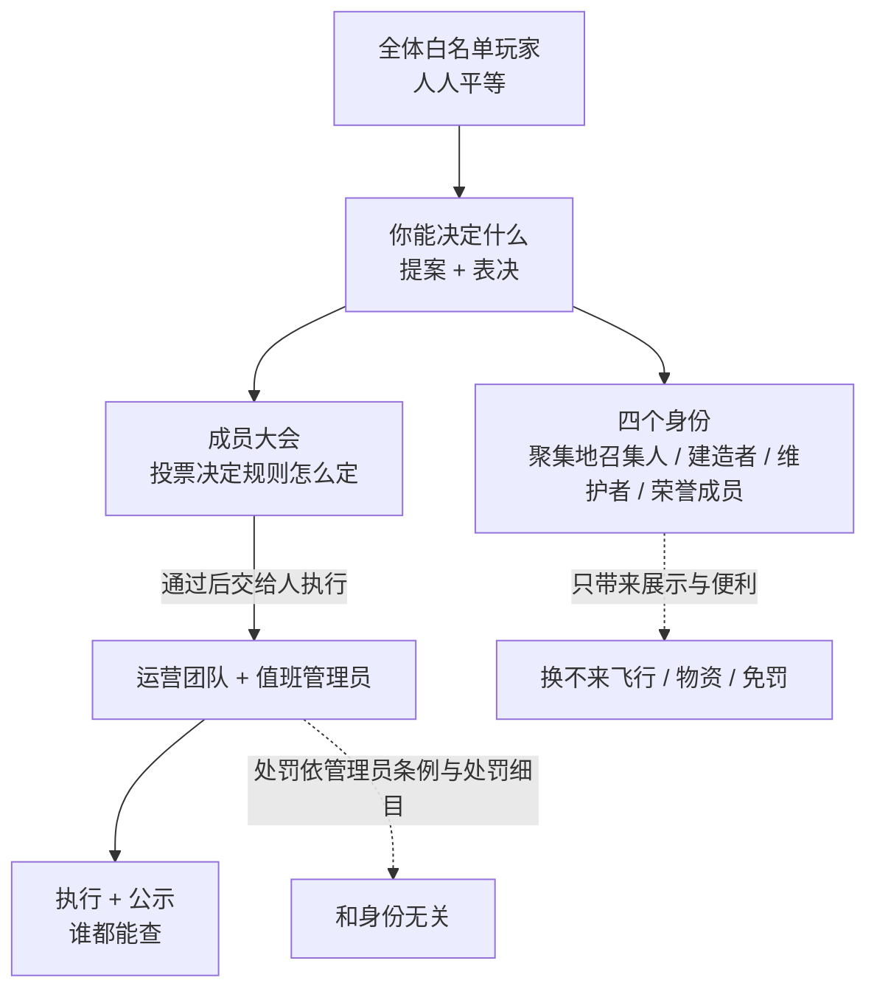
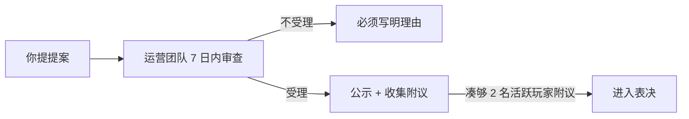
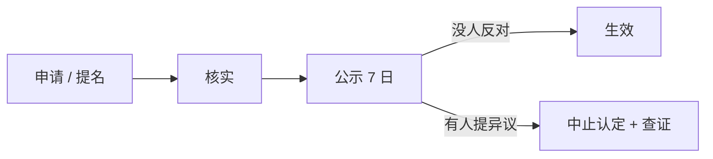

# 清屿服务器玩家身份与治理条例

> **版本：** v1.0.0 ｜ **更新日期：** 2026.09.24 ｜ **生效日期：** 2026.10.01 ｜ **面向对象：** 全体玩家

**先看这一句：** 决定权在全体活跃玩家手里，执行权在运营团队手里，身份只换面子和方便 —— 三件事互不越界。

这份文件比一般公告长，但**每一条后面都跟了一段「说人话」**。赶时间的话，可以直接看斜体那段。

清屿是玩家一起建起来的服。所以"服往哪走"这件事，不该只由几个人拍板。下面就是把这句话写成能执行的规矩。

## 目录

- [第一章 先说清楚三件事](#第一章先说清楚三件事)
- [第二章 你能决定什么](#第二章你能决定什么)
- [第三章 四个身份](#第三章四个身份)
- [第四章 离开又回来的人](#第四章离开又回来的人)
- [第五章 运营团队的边界](#第五章运营团队的边界)
- [第六章 有身份的人违规怎么办](#第六章有身份的人违规怎么办)
- [第七章 其他约定](#第七章其他约定)
- [附 常见疑问](#附常见疑问)

---

## 第一章　先说清楚三件事

一句话读这张图：**你能决定的事很多，但你不能直接处理某个人；运营团队能处理人，但不能自己定规则。**

### 1.1 不设等级

清屿**没有等级**：没有 Lv.1、Lv.2，也没有"贡献分排行榜"。你的"成长"不体现在数字上，而体现在别人怎么称呼你 —— 是"那个建了小镇的人"，还是"那个修了三公里隧道的人"。

*说人话：这里没有"练级"这回事。玩得久不会让你变强，只会让你更有名。*

**为什么不做等级？** 假设 10 级玩家能换飞行，会发生什么：

- 新人进服，看到天上全是人飞，自己只能跑，第一天就觉得自己像"下人"
- 老玩家为了升级开始挂机刷时长，服务器变成"谁熬得住谁赢"
- 最糟的是：**差距永远拉不平** —— 新人的时间永远追不上老人的积累

一个让人第一天就觉得"我不如别人"的服，不叫宁静港湾。

### 1.2 身份只换两样东西

身份换的是：**展示**（称号、署名、展示位）和**便利**（公告栏位、专属频道、提案优先）。

除此之外，什么都换不来。具体不能换的，见 [3.7](#37-身份换不来的五样东西)。

*说人话：身份是荣誉，不是装备。它让你更有面子，不让你更强。*

### 1.3 决定权和执行权分开

这是整份文件的骨架：

| | 谁 | 管什么 |
|---|---|---|
| **决定权** | 全体活跃玩家（成员大会） | 规则怎么定、重大事项怎么办 |
| **执行权** | 运营团队 + 值班管理员 | 运维、执行规则、处理纠纷、组织投票与公示 |

*说人话：定规矩的是大家，办事情的是少数人。**大家不能直接封人，少数人不能自己改规矩。***

**为什么要这样分？**

- 如果定规矩和执行都是同一批人，"玩家自治"就是一句空话 —— 你投了票，他可以不理
- 如果全交给大会，服务器半夜崩了没人能拍板

所以两边都留一点权力，但**谁都不许越界**。运营团队越界的约束写在[第五章](#第五章运营团队的边界)。

---

## 第二章　你能决定什么

### 2.1 四样权利，进来就有

只要你在白名单里，你就有四样东西，**不需要挣、不看资历**：

1. **能玩** —— 正常游戏
2. **能说** —— 在官方群里发言
3. **能提** —— 提提案（见 2.2）
4. **能投** —— 参与表决（见 2.3）

*说人话：新人和三年的老玩家，权利**一模一样**。这一条是整份文件的灵魂。*

入服与绑定流程见《[玩家守则](清屿服务器玩家守则.md)》5.1.1。

### 2.2 提案

想在服里加点什么、改点什么，任何人都可以提。流程是：

**举个例子：** 小明想在出生点加一个末地传送门。

1. 他在群里说"我提个案，出生点加末地门" → 交给运营团队
2. 运营团队 **7 天内** 回复；说受理就公示，说不行**必须说明理由**
3. 另外 2 个人说"我附议" → 进入投票
4. 全体活跃玩家投 **7 天**

*说人话：提个案的门槛很低，2 个人附议就够了。因为平时只有 5 个人在线，门槛设高了这条路就废了。*

### 2.3 表决

**先说两个词：**

- **活跃玩家** = 投票开始那天往前数 30 天里，**登录过至少 1 次**的人。是"登录过"，不是"一直在"。
- **成员大会** = 全体活跃玩家凑成的表决体。它不是一群人开会，而是**一次群投票的全体参与者** —— 没有主席，没有固定名单。

**在哪投？** 官方 QQ 群投票，持续 **7 日**。

**要不要在线？** **不用。** 你在群里投票就行，不需要守着服务器。

**多少票算过：**

| 事项 | 需要多少人参与 | 需要多少赞成 |
|------|--------------|------------|
| 一般事项 | ≥ 3 人 | 超过半数 |
| 重大事项 | ≥ 5 人 | 达到三分之二 |

**算给你看，省得掰手指：**

- 一般事项 3 人投票 → 超过半数就是"多于 1.5" → **至少 2 票赞成**才通过
- 重大事项 5 人投票 → 三分之二就是"至少 3.33" → **至少 4 票赞成**才通过

**两个必须注意的地方：**

1. **参与人数不够，投票直接作废。** 重大事项只来了 4 个人，那不管几票赞成都不算数。
2. 这不是刁难 —— 是防止"半夜叫三五个人投票就把事定了"。

**什么算"重大事项"？** 五类，都跟服务器根基有关：

- 封禁制度的实质修改（比如改处罚幅度）
- 《玩家守则》与《[管理员条例](清屿服务器管理员条例.md)》的修订
- 世界存档的公开与回档
- 服务器发展方向变更
- 身份体系的调整

*说人话：一般的事过半数就行；动根基的事要三分之二，否则一半人对另一半人的事很容易反复推翻。*

**门槛数字是可以调的。** 现在是按"平时 5 个人在线"定的。以后人多了或更少了，可以按同样流程改成合适的数字。

### 2.4 复议

投票结果出来后，**运营团队**有一次机会说"请再投一次"。条件是：

- 必须在结果公示后 **3 日内** 提出
- 必须说明理由
- 同样的复议**只有一次**

复议时门槛提高：

| 事项 | 原本 | 复议时 |
|------|------|--------|
| 一般事项 | ≥ 3 人 | **≥ 5 人** |
| 重大事项 | ≥ 5 人 | **≥ 8 人** |

*说人话：复议是"例外"，不是"反悔通道"。如果复议很容易，输的一方每次都要求重投，事情永远定不下来。*

**坦白说一句：** 以我们只有 5 人在线的规模，8 票的复议门槛**很可能永远用不上**。这是刻意的 —— 制度上留着，但希望它一次也别被用到。

### 2.5 和"七日阳光流程"怎么接

服务器本来就有一套"规则不能偷偷改"的流程（草案 → 公示 7 天 → 表决 → 登记）。但那套流程里写了"表决"，**没说谁来表决**。这份文件把那个空缺补上了：

> 七日阳光流程里的"表决"，就是 2.3 规定的成员大会表决。

所以这两份文件不冲突，是**拼在一起的**。公示期收集到的意见，会在投票前整理出来给大家看，然后再投。

流程本身的完整定义见《[清屿服务器七日阳光流程](清屿服务器七日阳光流程.md)》。

**唯一的例外是紧急修订：** 涉及服务器安全、数据安全的紧急修复，可以先改后公示（见 [5.2](#52-紧急情况可以先动手)），不用等投票。

---

## 第三章　四个身份

### 3.1 一览

| 身份 | 类型 | 怎么拿到 | 拿到之后有什么 |
|------|------|---------|--------------|
| **聚集地召集人** | 技能 | 建了个聚集地，并且有人常来 | 给聚集地起名、公告栏位、提案优先 |
| **建造者** | 技能 | 交了 3 件作品，或修了 1 项公共工程 | 称号、作品署名与展示位 |
| **维护者** | 技能 | 累计做了 10 次被采纳的维护工作 | 修订提案优先、专属频道 |
| **荣誉成员** | 授予 | 2 名活跃玩家联名提名 + 表决通过 | 称号永久保留 |

**"技能"和"授予"差在哪？**

- **技能身份**：你自己申请就能启动，标准是客观的（有作品、有记录），谁达到谁来
- **授予身份**：得别人提名你，标准是主观的（长期贡献），代表社区的认可

*说人话：技能身份靠作品，授予身份靠口碑。*

**为什么只有四个？** 八个身份记不住，记不住就等于没有。曾经列过"建筑师 / 工程 / 文档维护 / 新人引导 / 贡献者"，后来全合并了 —— 它们是**同一个东西的不同叫法**，拆开只会让人混乱。

**可以同时拥有多个身份。** 你既可以是聚集地召集人，也可以是建造者。

### 3.2 聚集地召集人

这是四个身份里**最有清屿特色的一个**，因为清屿一直鼓励的就是"建立社区化的聚集地"。

**认定条件（三条都要满足）：**

1. 聚集地**有人常来**：连续 30 天内，有 3 个以上**不同玩家**在该聚集地范围内活动
2. 聚集地**有公共设施**：集会点、公共仓库或公告区，至少有一个
3. 运营团队核实 + 公示 7 天没人反对

**「有人常来」怎么算？** 以服务器日志中的坐标记录为准：30 天内在该聚集地范围内有登录、放置方块或交互记录的不同游戏 ID，**按人头计数，同一玩家重复活动只算 1 人**。日志未覆盖的情形（如基岩版玩家的部分行为未被记录），可由 3 名玩家在公示期内联名证明作为补充。

*说人话：不靠感觉，靠日志。**同一个人来一百次也只算 1 个人** —— 这一条是防止开小号凑人头。*

**举个例子：** 阿清在坐标 1200, -800 建了个叫"北岸"的小镇，30 天里日志显示有 5 个不同的玩家在那儿活动，村里有公共仓库和一块公告牌 → 他申请聚集地召集人 → 核实 → 公示 7 天 → 通过。

**拿到什么：**

- 给镇子**正式命名**（命名要符合《[玩家守则](清屿服务器玩家守则.md)》8.1.1 的语言规范，不能带脏话）
- 占一个**公告栏位**
- 提提案时**优先排进议程**

*说人话：拿的是名誉和方便，**不是那块地归你了**。领地还是按领地规则走。*

### 3.3 建造者

**条件：** 3 件作品，或 1 项公共工程，经玩家见证通过。

**"玩家见证"是什么意思？** 就是有别的人看过、能证明是你建的。不是管理员一个人说了算。

**拿到什么：** 称号、作品署名、展示位。

### 3.4 维护者

这个身份是给**干活的人**的 —— 修订规则文档、带新人，都算。

**条件：** 累计 **10 次被采纳**的维护工作。

*说人话：注意是"被采纳"，不是"做过"。你提了 10 条修订建议但一条没通过，不算；通过 10 条，才算。*

**拿到什么：** 修订提案优先权、专属交流频道。

### 3.5 荣誉成员

**条件：** 任意 **2 名活跃玩家**联名提名 → 按一般事项门槛表决通过。

*说人话：这是唯一一个**不用自己申请**的身份，得别人提名你。长期贡献这种事自己说不太合适，得别人看得到。*

**拿到什么：** 称号**永久保留** —— 这是唯一一个**不因为不活跃而撤销**的身份。人家贡献过了，后来去忙了，称号也留着。

### 3.6 怎么拿到、什么时候会掉

**拿到：**

**会掉的情况：**

1. 连续 **90 天**没登录（荣誉成员除外）
2. 你自己不想留了
3. 靠假材料拿到的，或拿身份去谋私利（见 [6.2](#62-什么情况下收回身份)）

**丢了身份不等于丢权利。** 你依然能玩、能说、能提、能投 —— 那些是白名单自带的，跟身份无关。

**公示的意义：** 授予和撤销都要在群里说清楚"谁、什么身份、为什么、什么时候生效"。**不能悄悄给，也不能悄悄收。**

**公示期有人反对怎么办？** 异议成立的，认定或撤销中止；异议不成立的，要告诉提出人理由。对公示结果本身有争议，可以按《[管理员条例](清屿服务器管理员条例.md)》第十二条申请复核。

### 3.7 身份换不来的五样东西

运营团队**不许**以"他有身份"为理由，给任何人下面任何一项：

1. 飞行、创造模式、无敌这类改游戏机制的能力
2. 物品、货币、资源
3. 免除或减轻处罚
4. 绕过热力、性能、装置的限制
5. 对规则的解释权

已经给了的，必须**收回并公示**。

*说人话：这一条是给运营团队上的锁 —— 防止有人靠关系拿到不该拿的东西。第 5 条特别容易被忽略：**就算你是荣誉成员，你对规则的理解也只算一票，和新人的一票一样重。***

---

## 第四章　离开又回来的人

### 4.1 什么是回归者

**先澄清一件事：存档不对外公开下载。** 世界存档由运营团队备份保存，这是数据安全考虑。（顺带说：私自传播存档本来就是违规的，处罚细目 `A-012` 专门罚这条。）

**"回归者"指谁？** 曾经玩过、后来离开了、现在回来的老玩家。

*说人话：对回来的人，最难受的不是"我东西没了"，而是"没人认识我了"。这个身份解决的是后者。*

**回归者能拿回什么？** 凭原 ID 恢复**既有身份**和**维护工作记录**。

**两个细节：**

- 回归者状态**不需要公示**，也不因为 90 天不活跃被撤销（重新活跃自动恢复）
- 它**本身不带额外权益** —— 只是"确认你还是你"

### 4.2 怎么证明你是你

**三选一：**

- 原 ID 的历史记录
- 早期自己建的建筑坐标
- 两个以上玩家能证明是你

证明不了怎么办？**按新玩家流程入服。**

*说人话：这不是为难人。如果不做验证，别人冒用你的 ID 就能拿走你的身份，那才真麻烦。*

---

## 第五章　运营团队的边界

### 5.1 不能定规则

**运营团队是谁：** 运营团队，以及他们带的值班管理员。平时你们打交道的管理员，就是运营团队的具体落实者。

**他们干什么：** 服务器硬件软件的运行维护、执行规则、处理纠纷、组织提案和投票和公示。

**他们不干什么 —— 这一条最关键：**

> **运营团队不享有立法权。规则的修订，以成员大会的表决结果为准。**

而且这份文件还堵了后门：**除紧急情况外，运营团队不得中止、延后、或者不去执行已经通过的表决结果。**

*说人话：投票通过了就得办。不能拖着不办，也不能"研究研究"然后没了。*

### 5.2 紧急情况可以先动手

**现实问题：** 服务器要是崩了、数据要丢了，总不能等投票 7 天。

**所以给了紧急权：** 涉及安全、数据、严重漏洞的事，可以先做，立刻生效。

**但有两条约束，都要做到：**

1. **24 小时内公示** —— 说清楚做了什么、为什么做
2. **48 小时内提请追认** —— 让大会事后确认

**如果大会不追认？** 措施**自动失效**。而且运营团队还要按《[管理员条例](清屿服务器管理员条例.md)》第八条接受复核并说明情况。

*说人话：可以"先斩后奏"，但**必须奏**，而且奏了不通过就得撤回。*

---

## 第六章　有身份的人违规怎么办

### 6.1 一样罚，一分钟不少

**有身份，违规照样罚，一点都不少。**

**举个例子：** 荣誉成员在群里骂人 → 按处罚细目 `L-001` 禁言 2 小时。**不会因为他是荣誉成员就少禁一分钟。**

**累计加重也照样适用** —— 见《[管理员条例](清屿服务器管理员条例.md)》第十三条。

*说人话：为什么要专门写这一条？因为"有功劳的人"最容易变成"有豁免权的人"。提前写死，免得事后吵。*

### 6.2 什么情况下收回身份

| 情况 | 举例 |
|------|------|
| 用假材料拿到 | 谎报"我建了 3 件作品"，其实只有 1 件 |
| 冒用身份对外说话 | 说"我是清屿官方，我们准备和 XX 联动" |
| 转让、买卖身份 | 把"建造者"称号卖给别人 |
| 拿身份谋私利 | 用聚集地召集人身份强占别家的地 |

**怎么处理：** 撤销要**公示**；处罚幅度按《[管理员条例](清屿服务器管理员条例.md)》第十条与第十一条确定，参照[处罚细目表](处罚细目表.md)里性质最接近的条目。

---

## 第七章　其他约定

### 7.1 冲突时听谁的

各管各的，别打架：

| 争议类型 | 听谁的 |
|---------|--------|
| 身份怎么给、怎么投、怎么撤 | 听这份文件 |
| 什么行为算违规 | 听《[玩家守则](清屿服务器玩家守则.md)》 |
| 罚多少 | 听《[管理员条例](清屿服务器管理员条例.md)》+ [处罚细目表](处罚细目表.md) |

### 7.2 怎么改这份文件

修订走"七日阳光流程"，表决按**重大事项**门槛（≥ 5 人参与、三分之二赞成）。

**身份清单的增删也属于重大事项** —— 加一个身份、删一个身份，都得投票。

### 7.3 生效时间

**这份文件从 2026.10.01 起生效。**

**90 天内要补办：** 生效之前，如果运营团队已经口头给过谁类似的身份，**90 天内必须按正式流程补办公示**。逾期没补办的，相关权益中止，直到补办完成。

*说人话：这一条是防止"以前谁跟管理员关系好就口头给了个称号"继续模糊下去。*

### 7.4 这份文件的思路从哪来

我们的"玩家所有、玩家维护、玩家治理"思路，参考了合作服务器 **CubeX（方块叉）** 公开发布的治理文档。

但**清屿和 CubeX 不一样**，这点也说清楚：

| | CubeX | 清屿 |
|---|---|---|
| 出资人层级 | 有"股东" | **没有**，不设 |
| 身份数量 | 较多 | **4 个**，能记全 |
| 表决门槛 | 按其规模设定 | 按我们平时的在线规模设定 |

*说人话：交代来源是为了让玩家知道这不是拍脑袋想出来的；顺便也说明我们没打算照抄别人的制度。*

合作服务器的相关链接见[服务器信息](../服务器信息.md)。

---

## 附　常见疑问

**Q：我只是个新人，这些跟我有关系吗？**

有关系，但你只要记三点：① 你有提案权，想加什么可以提；② 你有投票权，跟你玩了多久无关；③ 你不欠任何人身份，也不用讨好谁。

**Q：我不想要任何身份，可以吗？**

完全可以。四个身份都是可选的，不要不影响你任何权利。

**Q：投票我投了，但总共只来了 2 个人，算数吗？**

不算。一般事项要 ≥ 3 人参与，2 个人的投票无效。这是防止小圈子半夜把事定了。

**Q：我 40 天没登录了，还能投票吗？**

不能。活跃玩家的标准是"30 天内登录过 1 次"。**登录一次就恢复资格**，不用重新申请。

**Q：身份会被随便撤销吗？**

不会。撤销必须公示，你可以提异议；对公示结果有争议，还能按《[管理员条例](清屿服务器管理员条例.md)》第十二条申请复核。

**Q：大会能不能直接决定封某个人？**

**不能。** 大会只管"规则怎么定"。处罚永远依据[处罚细目表](处罚细目表.md)，由运营团队执行。这是刻意分开的 —— 否则"人多"就变成了武器。

**Q：那如果运营团队不执行投票结果呢？**

这是违规的。[5.1](#51-不能定规则) 明确写了运营团队不得中止、延后或不予执行已通过的表决结果。

**Q：紧急处置如果不被追认，会怎样？**

措施自动失效，运营团队还要接受复核并说明情况。

**Q：跟 CubeX 是合作服，那我的身份能互认吗？**

**目前不能。** 两边身份标准不同（CubeX 有股东层，我们没有），互认得先解决"谁认证、谁撤销、纠纷谁裁"三个问题。这条路留着了，但没写进规矩，等条件成熟再说。

**Q：这份文件什么时候生效？**

**2026.10.01。**

---

## 相关文档

- **玩家行为规范：** 见[清屿服务器玩家守则](清屿服务器玩家守则.md)
- **管理员行为规范：** 见[清屿服务器管理员条例](清屿服务器管理员条例.md)
- **处罚幅度查询：** 见[处罚细目表](处罚细目表.md)
- **服务器地址与版本：** 见[服务器信息](../服务器信息.md)

---

© 清屿运营团队。
